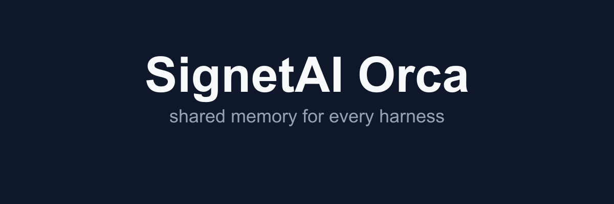

# SignetAI Orca: shared memory for every harness

> TechTide delivery fork of Signet. One memory graph across Claude Code, OpenCode, OpenClaw, Codex, Kimi, Hermes, Pi, and Gemini CLI. Local first with an audit trail back to source.

<p align="center">
  <picture>
    <source media="(prefers-color-scheme: dark)" srcset="docs/assets/orca-banner-dark.png" />
    <source media="(prefers-color-scheme: light)" srcset="docs/assets/orca-banner-light.png" />
    
  </picture>
</p>

<p align="center">
  <a href="https://github.com/Alexi5000/signetai_Orca/releases"></a>
  <a href="https://www.npmjs.com/package/signetai"></a>
  <a href="LICENSE"></a>
  <a href="https://docs.signetai.sh/benchmarking/"></a>
</p>

<p align="center">
  <a href="#quick-start">Quick start</a> ·
  <a href="docs/ORCA-HERO-STORY.md">Hero story</a> ·
  <a href="#harness-support">Harnesses</a> ·
  <a href="#documentation">Docs</a> ·
  <a href="https://docs.signetai.sh">Upstream docs</a>
</p>

Built by [Alex Cinovoj](https://alexcinovoj.com) ([X](https://x.com/AlexCinovoj) · [LinkedIn](https://www.linkedin.com/in/alexcinovoj)) for [TechTide AI](https://techtideai.io). Read the delivery story in [docs/ORCA-HERO-STORY.md](docs/ORCA-HERO-STORY.md).

Upstream core by Signet AI: [Signet-AI/signetai](https://github.com/Signet-AI/signetai). Product docs at [signetai.sh](https://signetai.sh).

## Trust

Local first. Your transcripts and imports stay in your workspace database. Dreaming builds derived memory with a path back to source, so recall stays inspectable and purgeable. No silent second writer. Telemetry is documented in docs/TELEMETRY.md. No paid tier trick in this README.

## Quick start (about 5 minutes)

### Install Signet

```bash
curl -fsSL https://signetai.sh/install.sh | bash                 # recommended
```

On Windows x64, run the PowerShell installer:

```powershell
iwr -useb https://signetai.sh/install.ps1 | iex
```

Or: `npm install -g signetai` / `bun add -g signetai`

The npm and Bun wrappers install the same compiled Signet binary through a matching native package.

Don't want to handle setup yourself? Paste this to your AI agent:

```
Install and fully configure Signet AI by following this guide exactly: https://signetai.sh/skill.md
```

Covers Linux x64/arm64, macOS x64/arm64, Windows x64, and Docker.

Durable transcript imports and imported-source deletion support Windows, Linux, and macOS. Uploads resume from durable database checkpoints.

### Setup

```bash
signet setup                         # interactive setup wizard
signet status                        # confirm daemon + pipeline health
signet dashboard                     # open memory + retrieval inspector
```

## Harness support

Signet runs underneath the tools you already use. Run `signet setup` to configure plugins and connectors. Currently, Signet supports:

|Harness|Integration path|
|---|---|
|[Claude Code](https://docs.anthropic.com/en/docs/claude-code)|Hooks + MCP|
|[OpenCode](https://github.com/sst/opencode)|Plugin|
|[OpenClaw](https://github.com/openclaw/openclaw)|Plugin|
|[Codex](https://github.com/openai/codex)|Native plugin + hooks/MCP fallback|
|[Kimi Code](https://github.com/MoonshotAI/kimi-cli)|Hooks + MCP / ACPX|
|[Hermes Agent](https://github.com/NousResearch/hermes-agent)|Memory provider plugin|
|[Pi](https://github.com/mariozechner/pi-coding-agent)|Extension|
|Oh My Pi|Extension|
|[Gemini CLI](https://github.com/google-gemini/gemini-cli)|MCP + GEMINI.md sync|
|[ForgeCode](https://forgecode.dev/)|Hooks + MCP|

> Don't see your favorite harness? File an [issue](https://github.com/Signet-AI/signetai/issues) and request that it be added!

<a href="https://signetai.sh/"></a>

Signet supports a wide variety of sources that can be imported directly into your agent's memory graph - included in dreaming sessions and surfaced as new connections in recall.

|Source|Notes|
|---|---|
|Obsidian|Real-time file watcher, can be connected to multiple Obsidian vaults, supports the LLM-Wiki format. Useful for connecting your agent's memory directly to shared knowledge bases in a read-only format.|
|Discord|Real-time Discord crawler, contributes to memory and connects to the existing knowledge graph.|
|Github|Real-time ingest of issues, pull requests, and discussions, contributes to memory and connects to the existing knowledge graph.|
|Slack|_coming soon_|
|Email|_coming soon_|
|Telegram|_coming soon_|
|Whatsapp|_coming soon_|
|Webpage imports|_coming soon_|
|Notion|_coming soon_|

Supported formats for one-time import:

|Format|Extensions|
|---|---|
|Word|`.doc`, `.docx`, `.docm`|
|PowerPoint|`.ppt`, `.pps`, `.pot`, `.pptx`, `.pptm`, `.ppsx`, `.ppsm`|
|Excel|`.xls`, `.xlsx`, `.xlsm`, `.xlsb`|
|OpenDocument|`.odt`, `.ods`, `.odp`|
|Rich Text Format|`.rtf`|
|EPUB|`.epub`|
|CSV|`.csv`|
|PDF|`.pdf`|

## How Orca fits together

- Daemon owns core behavior and durable transitions in `platform/daemon`. CLI, dashboard, desktop, SDK, and harness integrations are clients.
- `surfaces/cli` is the source of truth (`signet setup`, `signet status`, `signet dashboard`).
- `surfaces/dashboard` shows memory plus retrieval plus audit trail.
- `surfaces/desktop` plus `surfaces/tray` give always on presence.
- `surfaces/browser-extension` captures web context.
- `integrations/` covers claude-code, codex, forge, gemini, hermes-agent, kimi, oh-my-pi, openclaw, opencode, pi, and unreal.

## Documentation

| Goal | Start here |
| --- | --- |
| Install in 5 minutes | [Quickstart](https://docs.signetai.sh/quickstart/) |
| Run the CLI | [CLI Reference](https://docs.signetai.sh/cli/) |
| Configure identity and workspace | [Configuration](https://docs.signetai.sh/configuration/) |
| Connect a harness | [Harnesses](https://docs.signetai.sh/harnesses/) |
| Guard secrets | [Secrets](https://docs.signetai.sh/secrets/) |
| See memory model | [Knowledge Architecture](https://docs.signetai.sh/knowledge-architecture/) |
| Check recall quality | [Benchmarks](https://docs.signetai.sh/benchmarking/) |
| Read the delivery story | [docs/ORCA-HERO-STORY.md](docs/ORCA-HERO-STORY.md) |

## Benchmarks

Signet's latest tracked MemoryBench run averages **97.6% LongMemEval answer accuracy**.

The benchmark matters because local custody should not mean weak recall. Signet is designed to retrieve the right facts across long-running, multi-session conversations while keeping memory inspectable and repairable.

See [Benchmarks](https://docs.signetai.sh/benchmarking/#current-longmemeval-score) for the methodology, scoring note, and run workflow.

## Development

```bash
git clone https://github.com/Signet-AI/signetai.git
cd signetai

bun install
bun run build
bun test
bun run lint
```

```bash
cd platform/daemon && bun run dev     # Daemon dev (watch mode)
cd surfaces/dashboard && bun run dev  # Dashboard dev
```

Requirements:

- Bun for normal repo development
- Node.js 18+ for Node-targeted package surfaces
- macOS or Linux
- Optional for harness integrations: Claude Code, Codex, Kimi Code, OpenCode, OpenClaw, Gemini CLI, Pi, Oh My Pi, or Hermes Agent

## Contributing

New to open source? Start with [Your First PR](https://docs.signetai.sh/first-pr/). For code conventions and project structure, see [CONTRIBUTING.md](https://docs.signetai.sh/contributing/). Open an issue before contributing significant features. Read the AI Policy before submitting AI-assisted work.

## Star History

<a href="https://star-history.com/#Alexi5000/signetai_Orca&Date">
  <picture>
    <source media="(prefers-color-scheme: dark)" srcset="https://api.star-history.com/svg?repos=Alexi5000/signetai_Orca&type=Date&theme=dark" />
    <source media="(prefers-color-scheme: light)" srcset="https://api.star-history.com/svg?repos=Alexi5000/signetai_Orca&type=Date" />
    
  </picture>
</a>

Upstream history: [Signet-AI/signetai](https://star-history.com/#Signet-AI/signetai&Date).

## Contributors

Made with love by...

<a href="https://github.com/NicholaiVogel"></a> <a href="https://github.com/aaf2tbz"></a> <a href="https://github.com/Ostico"></a> <a href="https://github.com/BusyBee3333"></a> <a href="https://github.com/stephenwoska2-cpu"></a> <a href="https://github.com/PatchyToes"></a> <a href="https://github.com/ddasgupta4"></a> <a href="https://github.com/LeuciRemi"></a> <a href="https://github.com/nyashkn"></a> <a href="https://github.com/Alexi5000"></a> <a href="https://github.com/dragontvstaff"></a> <a href="https://github.com/maximhar"></a> <a href="https://github.com/alcar2364"></a> <a href="https://github.com/noamsiegel"></a> <a href="https://github.com/lost-orchard"></a> <a href="https://github.com/gpzack"></a> <a href="https://github.com/Jarvis-ORC-HPS"></a> <a href="https://github.com/nanookclaw"></a> <a href="https://github.com/quannon"></a> <a href="https://github.com/arnavgoel17"></a> <a href="https://github.com/glen-tl"></a> <a href="https://github.com/mikemikimike"></a>
<br clear="left" />

## Links

[Hero story](docs/ORCA-HERO-STORY.md) · [Upstream](https://github.com/Signet-AI/signetai) · [Docs](https://docs.signetai.sh) · [Changelog](./CHANGELOG.md) · [Security](./SECURITY.md)

[](https://star-history.com/#Alexi5000/signetai_Orca&Date)

Built by [Alex Cinovoj](https://alexcinovoj.com) for [TechTide AI](https://techtideai.io).

## Built from Signet

This is TechTide Orca, a maintained fork for client delivery. Upstream is [Signet-AI/signetai](https://github.com/Signet-AI/signetai) by Signet AI. Product docs live at [signetai.sh](https://signetai.sh) and [docs.signetai.sh](https://docs.signetai.sh). Our changes are Orca positioning, hero story, docs assets, and README structure. Core memory behavior stays with upstream. License stays Apache-2.0. See LICENSE, NOTICE, and THIRD_PARTY_LICENSES.md. Our repo is [Alexi5000/signetai_Orca](https://github.com/Alexi5000/signetai_Orca).

## License

Apache-2.0.

---

[signetai.sh](https://signetai.sh) ·
[docs](https://docs.signetai.sh) ·
[upstream](https://github.com/Signet-AI/signetai) ·
[orca fork](https://github.com/Alexi5000/signetai_Orca) ·
[issues](https://github.com/Signet-AI/signetai/issues)
